# Fazz-Tracks - ReadME

[Access the live site here.](https://craig90dev.github.io/fazz-tracks/)

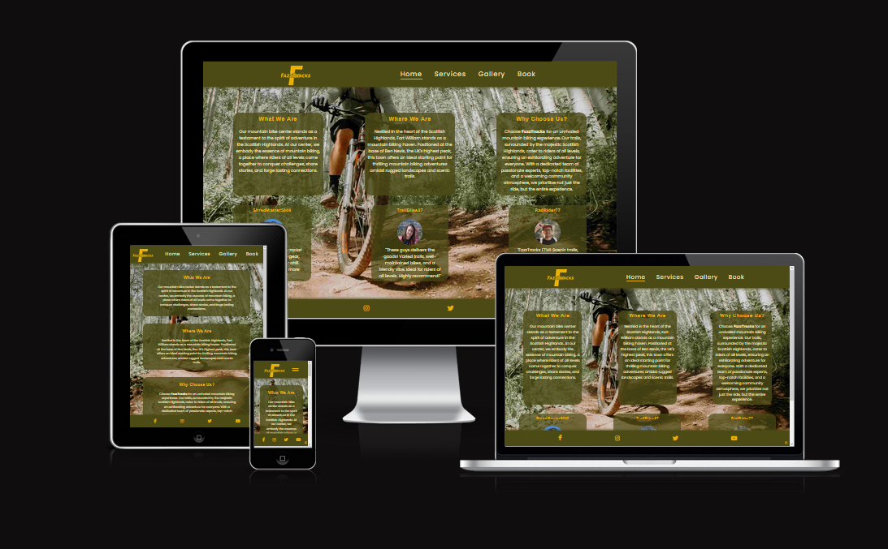

This is the documentation for the Fazz-Tracks website. Built using HTML5 and CSS3 for the Milestone 1 Project for Code Institutes Web Development Diploma course. 

******

## Contents

* [The User Experience](#the-user-experience)
    * [Strategy](#strategy)
    * [Scope](#scope)
    * [Structure](#structure)
    * [Skeleton](#skeleton)
* [The User Interface](#the-user-interface)
    * [Surface](#surface)
* [Features](#features)
    * [Page Navigation](#page-navigation)
    * [Footer](#footer)
    * [Index Page](#index-page)
    * [Services Page](#services-page)
    * [Gallery Page](#gallery-page)
    * [Booking Page](#booking-page)
* [Future Implementations](#future-implementations)
* [Accessibility](#accessibility)
* [Technologies Used](#technologies-used)
* [Deployment and Local Development](#deployment-and-local-development)
    * [Deployment](#deployment)
    * [Local Deployment](#local-deployment)
* [Testing](#testing)
    * [W3C Validator](#w3c-validator)
    * [Lighthouse](#lighthouse)
    * [Devices Used](#devices-used)
    * [Manual Testing](#manual-testing)
* [Issues/Bugs](#issues\/bugs)
    * [Solved Issues](#solved-issues)
    * [Known Bugs](#known-bugs)
* [Credits](#credits)
    * [Help Used](#help-used)
    * [Content](#content)
    * [Media](#media)
    * [Acknowledgements](#acknowledgements)

******

## The User Experience

### Strategy

This project is designed with the aim to showcase the my skills and progression in learning the HTML5 and CSS3 coding languages through the Code Institute web development diploma course with a simple website, using my own resources and knowledge to create an example of a real world scenario for a customer requiring a website to show potential visitors their Mountain Bike Center why they should visit and what is available through them.

### - User Stories

**First Time Visitor goals** -

a. As a first time visitor I want to be able to easily understand the purpose of the website and what the business offers.

b. I want to be able to easily navigate the site without having to use the browsers back/forward buttons at any time.

c. I want to be able to easily access the business social media platforms to further assess the suitablility of the business for my needs.

d. I want to be able to see proof of previous customer visits through the use of a Gallery or Review page.

**Returning Visitor goals** -

a. As a returning visitor I want to be able to see up to date reviews or photos on the websites Gallery to see they are active on the business website.

b. I want to be able to easily book a visit to the place of business once I am happy with the service they provide.

**Frequent Visiter goals** -

a. As a frequent visitor I want to see updates for opening times and seasonal dates available for future bookings.

b. I want to see new features as the website expands.

******

### Scope

Taking the user goals into account I decided to start with four main content pages:

**Home Page** - This would provide users with information on the "What, Where and Why" the business is about and why they should choose this business, along with reviews from previous visitors.

**Services Page** - This would provide details of what the user can expect and a price list of the services provided by the business.

**Gallery Page** - This would show users images of previous visitors experiences at the center.

**Booking Page** - This would allow users to book a visit to the site.

With these main pages there would also be links to the social media accounts of the business, allowing users to see more up-to-date experiences of other visitors at the center and any events that the business may promote.

******

### Structure

With the website starting out very simply, the navigation layout is linear and encourages the user to read information about the business, what the business provides, view some of the previous users experiences and then lastly make a booking.

******

### Skeleton

#### Wireframes

All Wireframes have been created using [Balsamiq](https://balsamiq.com/).

Fazz-Tracks Full Responsive Wireframes

**Desktop View:**
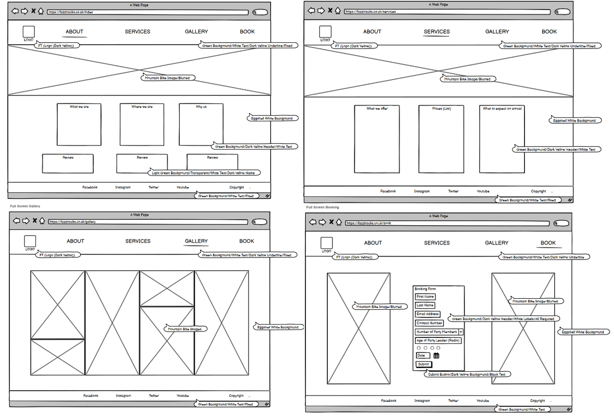

**Tablet View:**
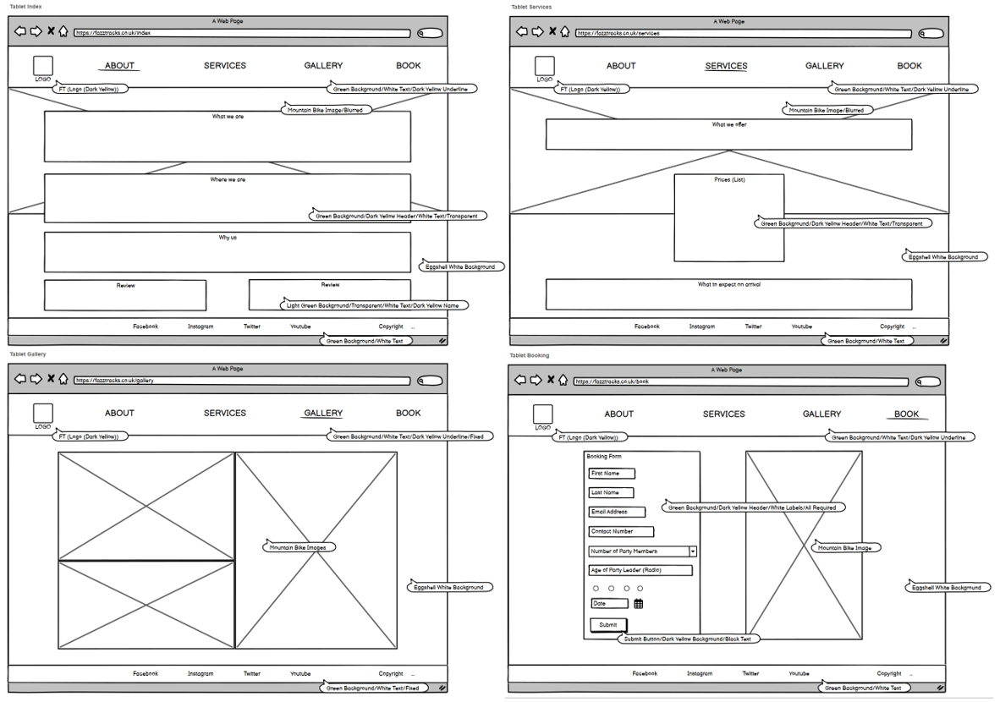

**Mobile View:**
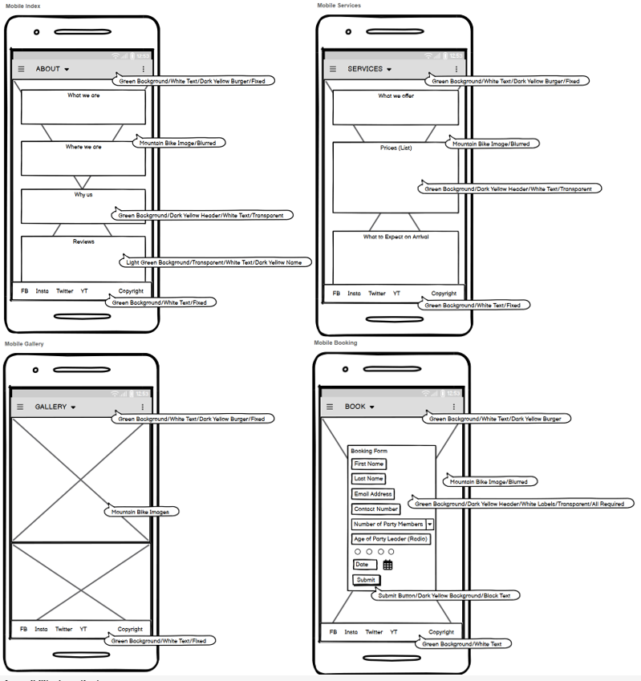

The wireframes shown here are the ideas for the initial layout of the website. Some styling has been changed since testing to allow for a better user experience and improve accessibility.

******

## The User Interface

### Surface

#### Colours

I used [mycolor.space](https://mycolor.space/?hex=%2309EA69&sub=1) to research the colourscheme for the site and decided to use colours from different colourschemes for the final website.

**#f7f2cb** - I chose this colour as an "earthy white" approach for the visible backgrounds of each page. This was partly to help with accessibility as a darker background will have taken longer to load. It also helps the site appear light without the use of a basic white. I also used this colour for the menu text and content text. This was because the colour stood out from the background and also helped with the consistency and flow of the website colourschemes.

**#4c4b16** - I used this colour for the header, footer and content boxes. This was to give the website a "forresty" feel to imply to the user that the website is related to the outdoors in some way. It stands out from the background colour above but is not too dark as to distract the user from the website content. The content boxes are slightly transparent so the background images are still visible through them, but not so much that the background takes away the attention of the user.

**#e7b10a** - This colour was used for the Fazz-Tracks logo, all headers in the page content, the social media links in the footer, the submit button on the booking page and also the active class/hover underline in the menu. I decided to use this as it stood out from the #4c4b16 (green) and caught the users attention, allowing them to identify parts of the site content I wanted to stand out to the user.

#### Typography

The fonts have been imported from [Google Fonts](https://fonts.google.com/).

The 'Poppins' font has been used for the generic content text of the website. I chose this font as it is easy to read and provides the user with a slightly different font to a generic website font. The 'sans-serif' font is used as the fallback font as a generic content font.

The 'Roboto Mono' font has been used for the h1 and h2 headers on the website as it stands nice and bold against the other content and is easy to read. The 'helvetica' font is used as the fallback font as a generic heading font.

******

## Features

### Page Navigation

Mobile Header

>

Desktop Header

On mobile devices the header appears as the "Fazz-Tracks" logo to the left with a "solid bar" icon on the right. The solid bar icon allows the user to toggle the navigation menu into view by clicking on it. On larger screens the navigation toggle icon dissapears and the navigation links appear as text. These navigation links have an underline feature showing the current page the user is on and also have a hover feature, showing the user the text acts as a link by showing an underline.

### Footer

The footer on each page contains links to various social media websites. These links open in a new tab and represent the social media accounts the business would be using in a real life scenario.

### Index Page

Index Page in Mobile view

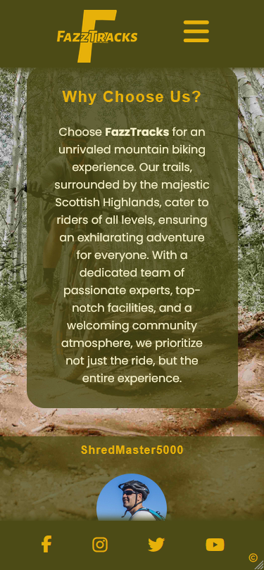

Index Page in Tablet view

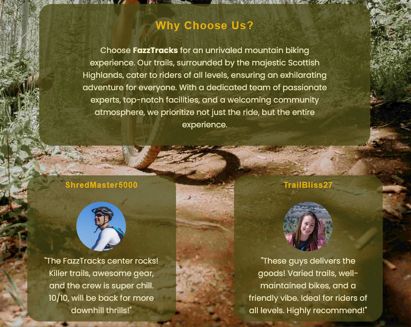

Index Page in Desktop view

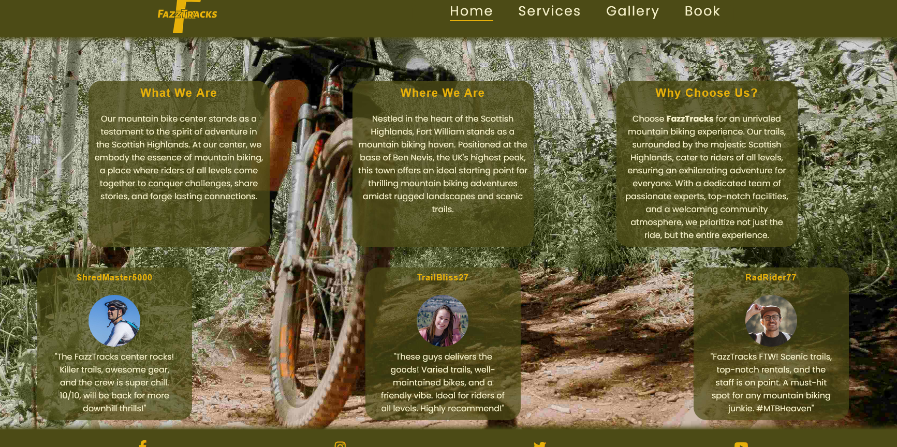

On mobile devies, the three content boxes appear in a single column showing each content box in order, followed by three visitor reviews. On tablet screens, this view changes to show just two reviews next to each other to use the extra space, but not look too generic at the same time by having three content boxes with three review boxes below them. All three reviews are shown on larger/desktop screens and the content boxes appear next to each other, rather than below each other, to use up the extra space provided.

### Services Page

Services Page in Mobile view

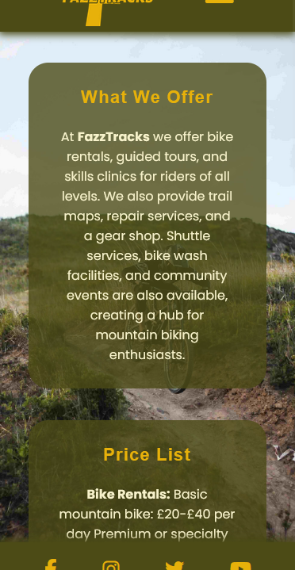

Services Page in Desktop view

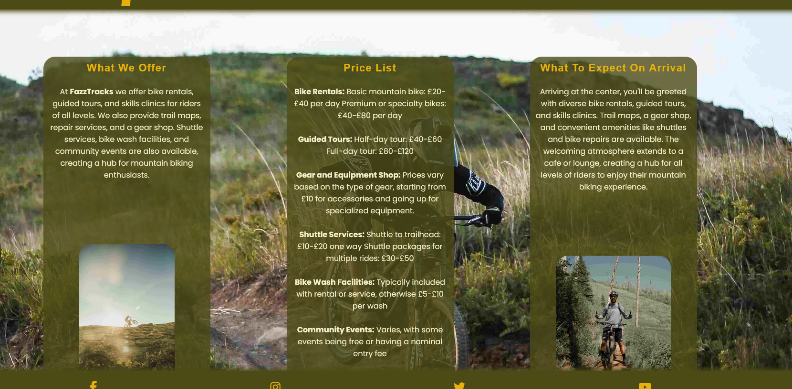

The services page appears in a single column on mobile and tablet devices. This changes when viewed on larger/desktop screens as the content appears next to each other and two images also appear to give the user more interest.

### Gallery Page

Gallery Page in Mobile view

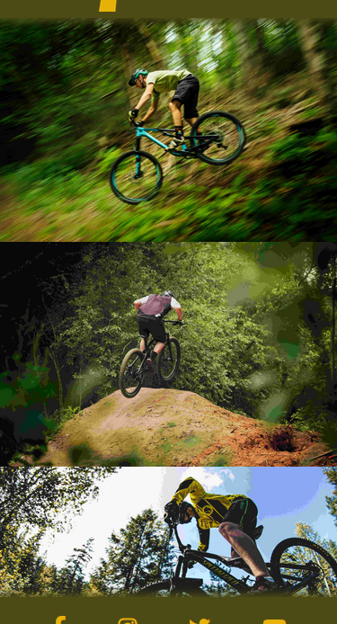

Gallery Page in Tablet view

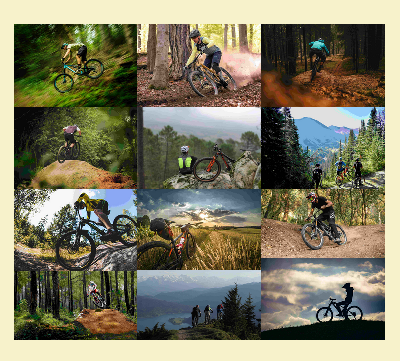

All images in the Gallery appear in a single column on mobile devices. On tablet/larger screens, this changes to three columns with space around the outside, giving the users a better experience on the gallery page.

### Booking Page

Booking Page in Mobile view

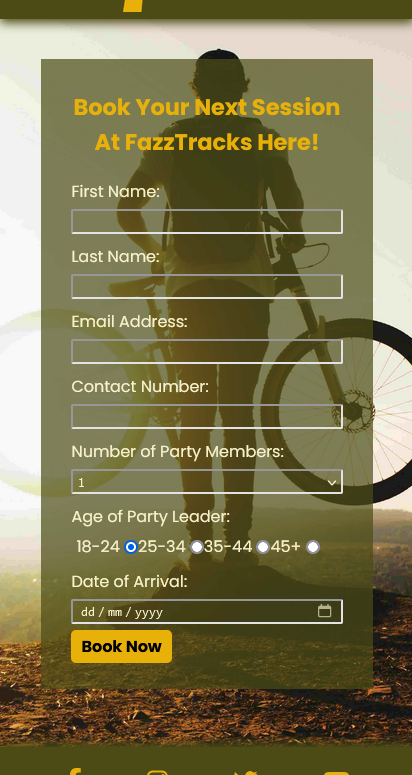

Booking Page in Tablet view

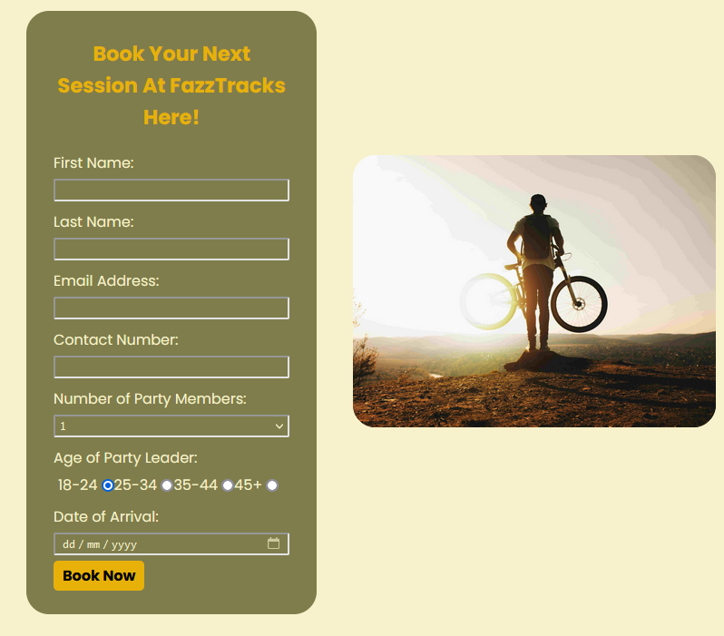

Booking Page in Desktop view

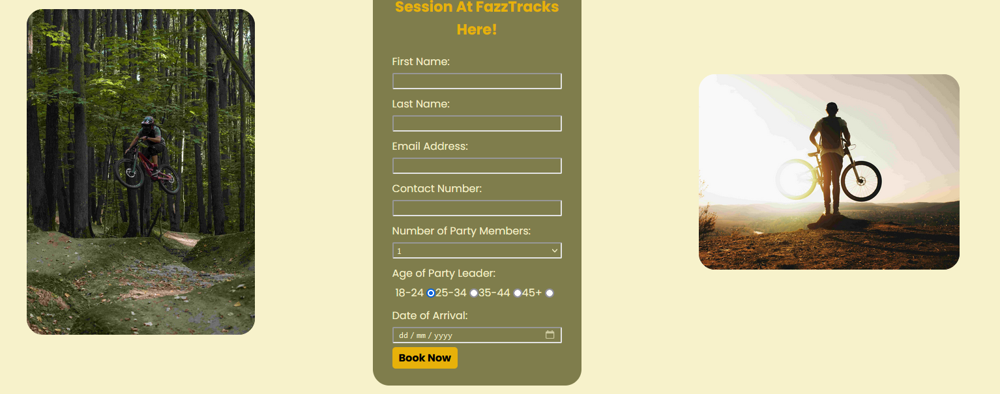

On mobile devices, the booking page only consists of the booking form itself. On tablet screens this changes to the booking form on one side with an image opposite. This changes again on larger/desktop screens as an image will now appear on both sides of the booking form, giving the user more to look at.

******

## Future Implementations

1. To create functionality in the booking form. This would include the correct formatting of input sections (Only allow future dates in date field, must only be eleven digits in the phone number field ect.), and to add the ability to contact a back-end server in order to store customers booking details.

2. To add a map function to the website, allowing the user to view Google Maps in a window to see where the business is located.

3. To add a page for customer reviews to be imported and updated on the Home page after approval from the business owner and for reviews to be cycled through after refreshing the Home page.

4. To add a page for visitors to be able to upload their own images and videos from their experiences at Fazz-Tracks and display them on the Gallery page.

5. To implement the ability to view images in the Gallery as a larger image and cycle through them.

******

## Accessibility

### Alt Text

Alt text has been included for all images across the site, including all images in the ReadME.md and the FazzTracks logo.

### Aria Labels

Aria labels have been used for all links across the site.

### Fonts

The fonts have been chosen for easy readability and the headers contain extra letter spacing to make them easier to read.

### Colours

The colours throught the site have been chosen in order for the site to be light and colourful and easy to distinguish certain sections of the website without being too harsh on the eyes.

******

## Technologies Used

### Languages Used

HTML & CSS

### Frameworks, Programs and Libraries Used

[**Visual Studio Code**](https://code.visualstudio.com/) - All coding and styling of the website was done using VSCode.

[**GitPod**](https://gitpod.io/) - To host the local server used and to save files to the GitHub Repository.

[**GitHub**](https://github.com/) - To save and store files for the website.

**Git** - For version control.

[**Balsamiq**](https://balsamiq.com/) - For wireframes during website design period.

[**Icons8**](https://icons8.com/) - For FavIcon used.

[**Font Awesome**](https://fontawesome.com/icons) - For the icons used in the Navbar and Footer.

[**Google Fonts**](https://fonts.google.com/) - To import the fonts used on the website.

[**Pexels**](https://www.pexels.com/) - For stock images used.

[**Unsplash**](https://unsplash.com/) - For stock images used.

[**Applogo**](https://app.logo.com/flow/business-name) - For design of the FazzTracks logo.

[**UI.Dev**](https://ui.dev/amiresponsive) - To show the website on various screen sizes.

**Firefox Dev Tools** - To troubleshoot and test responsiveness of various screen sizes.

**Chrome Dev Tools** - To troubleshoot and test accessibility using the Lighthouse feature.

[**ResizePixel**](https://www.resizepixel.com/) - To compress all images used throughout the website.

******

## Deployment and Local Development

### Deployment

1. Log in to [GitHub](https://github.com/).

2. Find the repository for [this project](https://github.com/Craig90Dev/fazz-tracks).

3. Click on the Settings Link.

4. Click on the Pages link in the navigation bar on the left side of the screen.

5. In Source Selection, choose Main from the Select Branch drop down menu. Select Root from the Select folder drop down menu.

6. Click Save. Your live GitHub site is now deployed at the URL shown.

### Local Deployment

#### How to Fork

1. Log in to [GitHub](https://github.com/).

2. Find the repository for [this project](https://github.com/Craig90Dev/fazz-tracks).

3. Click the Fork button in the top right corner of the screen.

#### How to Clone

1. Log in to [GitHub](https://github.com/).

2. Find the repository for [this project](https://github.com/Craig90Dev/fazz-tracks).

3. Click the Code button and select whether you would like to clone with HTTPS, SSH or GitHub CLI. Copy the link displayed.

4. Open the terminal in your code editor and change the current working directory to the location you want to use for the cloned directory.

5. Type 'git clone' into the terminal and then paste the link you copied in step 3.

******

## Testing

### W3C Validator 

[W3C](https://validator.w3.org/#validate_by_input) was used to validate all HTML for the site via the direct input. Each page was tested individually and final editing has been done to ensure all results produced were error free.

Home Page

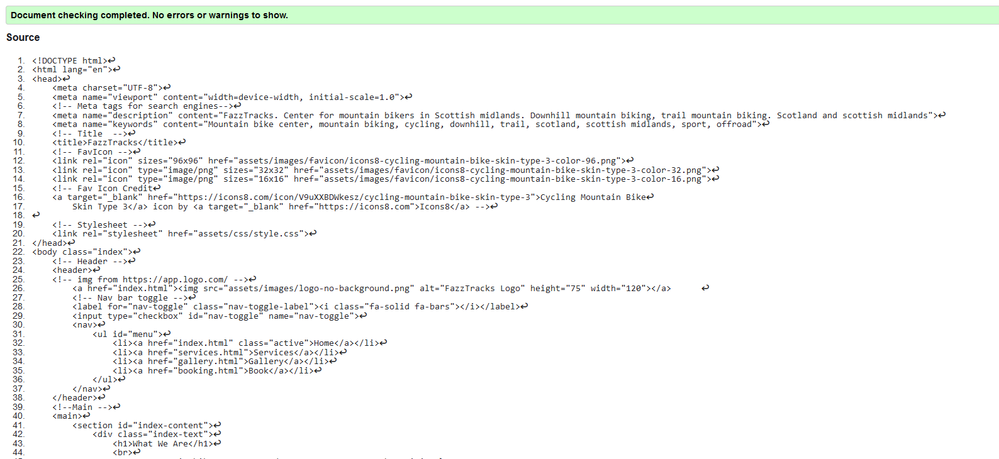

Services Page

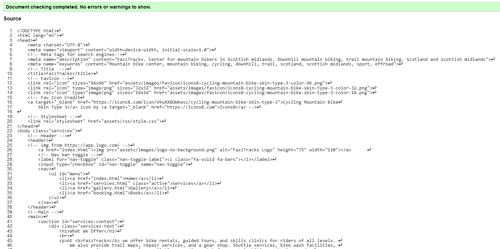

Gallery Page

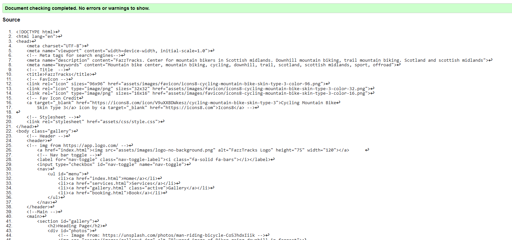

Booking Page

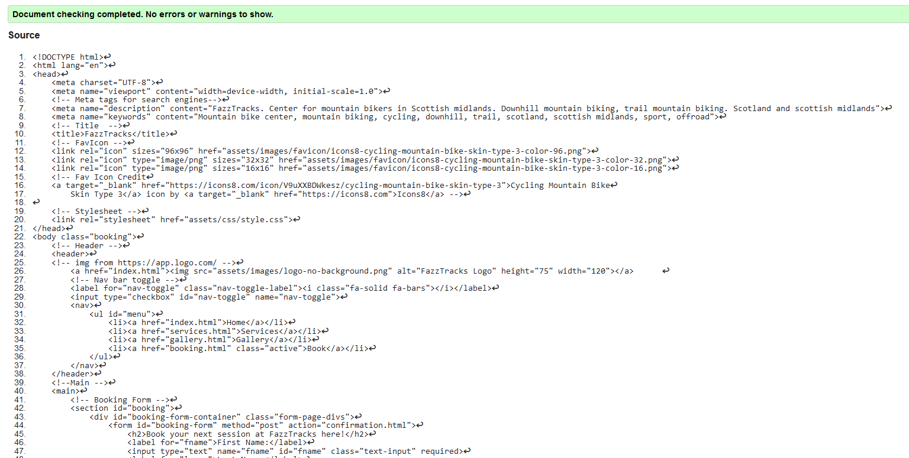

[W3C](https://jigsaw.w3.org/css-validator/) was used to validate all CSS for the site via direct input. Final editing has been done to ensure all results produced were error free.

Style.css

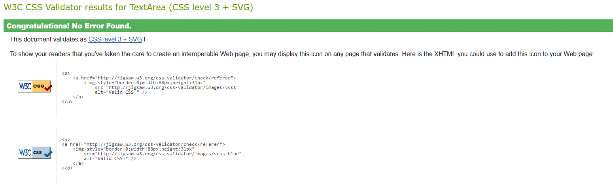

### Lighthouse

The Lighthouse tool in Chrome Dev Tools was used to test the performance, accessibility, best practices and search engine results ranking of the website.

#### Mobile Results

Home Page

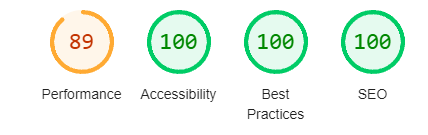

Services Page

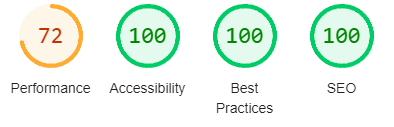

Gallery Page

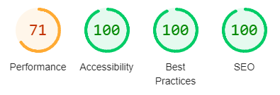

Booking Page

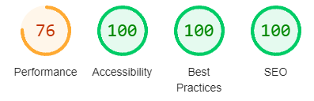

#### Desktop Results

Home Page

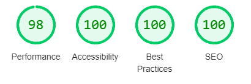

Services Page

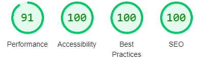

Gallery Page

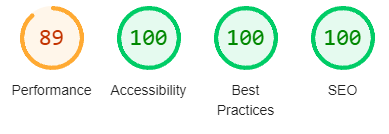

Booking Page

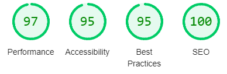

The content sections of the Home and Services page seem to affect the performance in mobile view as they are large areas of movement when scrolling. Also, the images on the Gallery page affect the performance in both mobile and desktop view due to the fact there are multiple images trying to load at once. Images have been compressed but this may need revisiting at a later date.

### Devices Used

**Mobile**
iPhone 11 Pro was used to test the mobile features of the website.

**Desktop**
Acer Aspire 5 A515 was used to test the desktop features of the website

**Browsers**
The Safari browser was used for testing on mobile.

The Mozilla Firefox, Google Chrome and Microsoft Edge browsers were used for testing on desktop.

### Manual Testing

| Feature | Expected Outcome | Testing Performed | Result | Pass/Fail |
| --- | --- | --- | --- | --- |
| FazzTracks Logo | Acts as a link back to the Home Page from whatever page the user is on | Clicked FazzTracks logo on each page | Home Page loads | Pass |
| Nav Bar Toggle | Menu opens on mobile devices when already closed | Clicked the toggle icon | Nav Menu opens | Pass |
| Nav Bar Toggle | Menu closes on mobile device when already open | Clicked on toggle icon | Nav Menu closes | Pass |
| Active Page Indicator | An underline appears under the title of the current page | Went to each page of the website | Active underline appears under the title of the page currently open for every page | Pass |
| Nav Menu Hover Effect | Underline appears on mouse hover over menu items | Went to each page and hovered over menu items | Underline appears under menu itmes when hovered over on each page | Pass |
| Home Nav Link | Clicking the Home nav link takes the user to the Home page | Clicked on the Home nav link on each page | Taken back to the Home page from all pages | Pass |
| Services Nav Link | Clicking the Services nav link takes the user to the Home page | Clicked on the Services nav link on each page | Taken back to the Services page from all pages | Pass |
| Gallery Nav Link | Clicking the Gallery nav link takes the user to the Home page | Clicked on the Gallery nav link on each page | Taken back to the Gallery page from all pages | Pass |
| Booking Nav Link | Clicking the Booking nav link takes the user to the Home page | Clicked on the Booking nav link on each page | Taken back to the Booking page from all pages | Pass |
| Submit Button in Form | Clicking the submit button takes the user to the Code Institute FormDump page when required form input fields are populated | Populated the required form inputs and clicked the Submit button | Taken to the Code Institute FormDump page | Pass |
| Form Required Fields | When form input is missing, message appears telling the user the field is required | Went through all required fields, missing each one individually | Message appeared for each field telling me an input is required | Pass |
| Form Phone Contact Field | Field will only accept number inputs | Tried typing letters into the form Phone Contact input | Field only accepts numbers | Pass |
| Social Media Links | Each social media link takes the user to the website in a seperate tab | Clicked each social media link on each page | All social media links went to the correct website from every page. All links opened in a new tab | Pass |

## Issues/Bugs

### Solved Issues

| Issue | Details | What Was Done | Fixed? |
| --- | --- | --- | --- |
| FazzTracks Logo | The FazzTracks Logo not loading | Adjusted file path from absolute to relative | Fixed |
| Booking Page Images | The images on the Booking page in desktop view appeared in the incorrect order with the form on the far left side | Using CSS, used the "order" function to reposition | Fixed |
| All Images | All images in the website were to big and page loading was taking longer than neccessary | Compressed all images and replaced old ones | Fixed |
| Gallery Page | The images used on the Gallery page created large open spaces in desktop view | Edited and cropped Gallery page images as neccessary | Fixed |
| Form Submit Button link | When clicking the Submit button on the Booking page, the link wasn't working | Changed the Submit button from an input to an anchor wrapped around text | Fixed |

### Known Bugs

1. In the form on the Booking page, the Email field accepts any form of text as long as there is an "@" symbol in the text. Ideally, this would only accept recognised email accounts and may be implemented in the future.

2. In the form on the Booking page, the date field currently accepts any date, whether that be in the past or many years in the future. When my knowledge improves I would like to make this field only accept dates that are one year in the future and refuse any past dates.

No other known bugs are in this version of the website

******

## Credits

### Help Used

[Code Institute](https://learn.codeinstitute.net/courses/course-v1:CodeInstitute+LRFX101+2023_Q2/courseware/e805068059af42af87681032aa64053f/7525117e5cd144daa2a7b0c57843bbee/) - Love Running Project for the Navigation Bar toggle and drop down menu for mobile devices.

[Code Institute](https://learn.codeinstitute.net/courses/course-v1:CodeInstitute+LRFX101+2023_Q2/courseware/e805068059af42af87681032aa64053f/7525117e5cd144daa2a7b0c57843bbee/) - Love Running Project for Media quereys and responsivness.

[Code Institute](https://learn.codeinstitute.net/courses/course-v1:CodeInstitute+LRFX101+2023_Q2/courseware/e805068059af42af87681032aa64053f/92a91cf7fcee4361a2af651b7827a341/) - Love Running Project for support with styling within CSS 

[w3schools](https://www.w3schools.com/css/css_display_visibility.asp) - For hiding and displaying various images on the site.

[stack overflow](https://stackoverflow.com/questions/17999067/how-to-force-only-numbers-in-a-input-without-javascript) - For making the contact number input allow numbers only using JS.

### Content

[ChatGPT](https://chat.openai.com/) - For general content and price list.

### Media

[Pexels](https://www.pexels.com/) - For stock images used for background images and page content.

[Unsplash](https://unsplash.com/) - For stock images used in Gallery and reviews.

[logo.com](https://logo.com/logos/application) - For the Fazz-Tracks logo

[Icon8](https://icons8.com/icon/V9uXXBDWkesz/cycling-mountain-bike-skin-type-3) - For the FavIcon.

### Acknowledgements

Dick Vlaanderen (Mentor) - For the advice and encouragement I have received throughout the creation of the Fazz-Tracks website.

The Slack community - For help needed with various questions and problems I had throughout the project.

Friends and Family - For helping me test the website on various devices and giving feedback throughout.